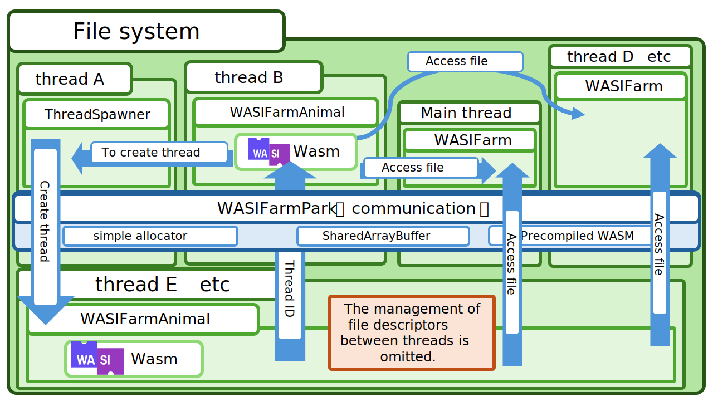
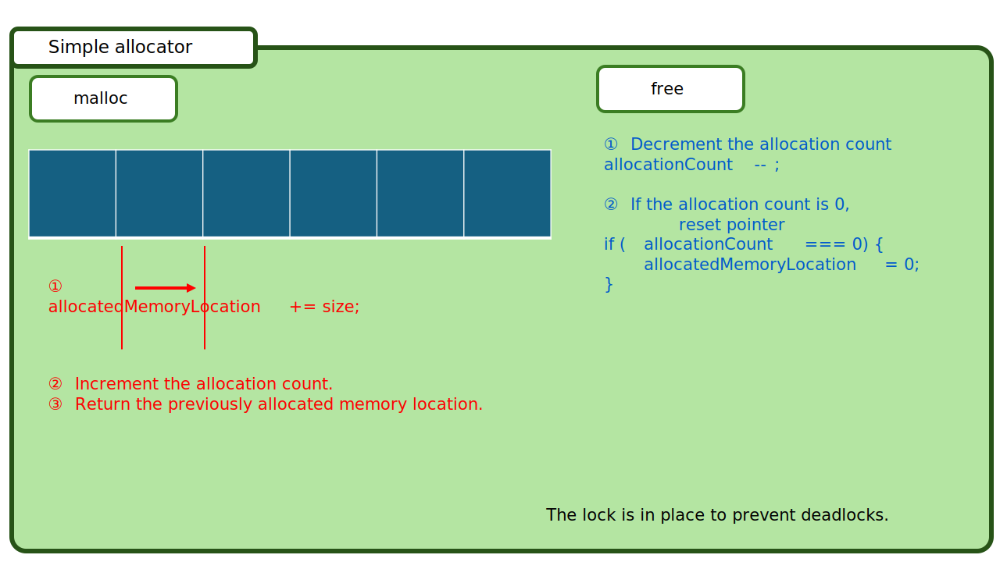

# A pure javascript shim for WASI Preview 1 threads

> [!WARNING]
> The code in this directory is less production ready than the main browser_wasi_shim code.
> This code requires `SharedArrayBuffer`, `waitAsync` and `Atomics` to be enabled in the browser, so it may not work in all browsers.
> For example, Firefox failed to run the demo in this directory.
> Chrome worked fine.
> This library require `cross-origin isolation` to be enabled in the browser.

This project implement threads on browser_wasi_shim

# Features
- [x] thread creation
- [x] Filesystem wrapper accessible by multiple workers
- [ ] thread pool

# Building
```sh
$ npm install
$ npm run build
```

# Running the demo
```sh
$ git submodule update --init
$ cd examples && npm install && npm run dev
```
And visit http://localhost

# Architecture
In the thread that maintains the file system for `@bjorn3/browser_wasi_shim`, file access is awaited asynchronously, while in the thread executing the WASM, file access is performed synchronously.

Since the functions called within the WASM are invoked synchronously, it is not possible to properly create web workers. Therefore, it is necessary to first create a dedicated thread for generating web workers.

Please refer to the diagram below for more details.

<!-- @/architecture/slide1.svg -->


Additionally, since data of unknown size is being exchanged, an allocator is essential. A simple allocator is implemented on the assumption that the allocated memory will be released promptly.

<!-- @/architecture/slide2.svg -->

